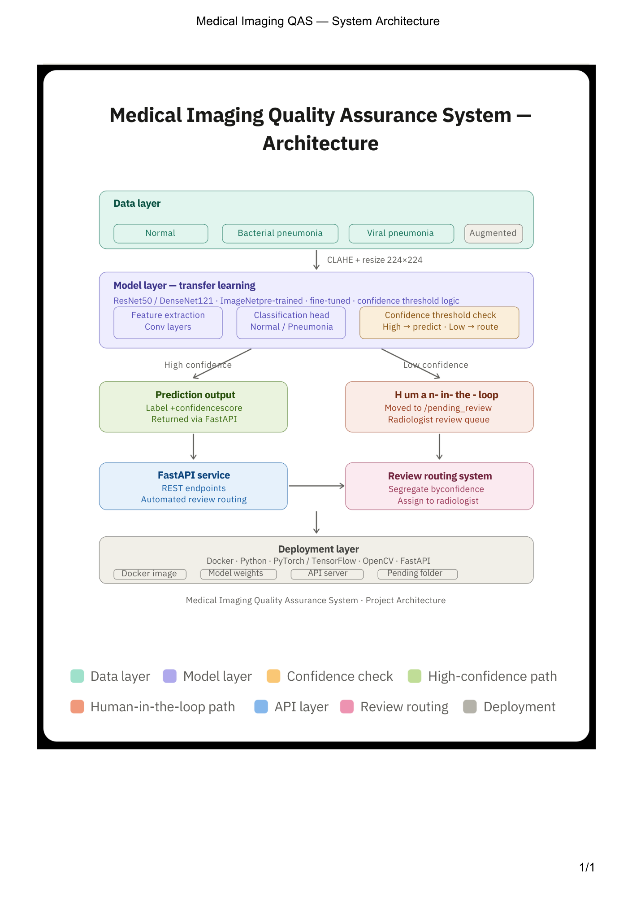

# Medical Imaging Quality Assurance System

**Deep Learning + Computer Vision + Healthcare AI**

## Problem Statement

Medical imaging such as chest X-rays is commonly used to detect lung diseases like pneumonia. While deep learning models can automatically analyze these images, many systems only give a prediction without showing where the disease is present, and sometimes the predictions may not be reliable. This project aims to develop a Medical Imaging Quality Assurance System that uses a pretrained deep learning model to detect pneumonia in chest X-ray images, highlight the affected region in the image, and evaluate the confidence of the prediction. If the model’s confidence is low, the system will flag the case for expert review to ensure accurate and reliable diagnosis.

## Overview

The **Medical Imaging Quality Assurance System** is an AI-powered healthcare application designed to automatically screen **Chest X-ray images for Pneumonia**. The system uses deep learning and computer vision techniques to analyze X-ray images and assist medical professionals in early diagnosis.

The main goal of this project is to build a **reliable AI-assisted diagnostic pipeline** where predictions are made automatically when the model confidence is high, while **low-confidence predictions are routed to a radiologist for manual review**. This approach introduces a **human-in-the-loop system** that improves safety, reliability, and trust in AI-based medical applications.

This project integrates **deep learning, medical image preprocessing, automated decision routing, and API deployment** into a complete pipeline suitable for real-world healthcare environments.

---

# Project Objectives

* Build a **deep learning model** capable of detecting pneumonia from chest X-ray images.
* Use **MONAI-based preprocessing techniques** to enhance medical image quality.
* Implement a **confidence-based routing system** to decide whether a prediction should be automated or reviewed by a radiologist.
* Create an **API service using FastAPI** to serve model predictions.
* Package the system inside a **Docker container for easy deployment**.

---

# System Architecture



The system workflow follows these steps:

1. Input chest X-ray image is uploaded.
2. Image undergoes **medical preprocessing using MONAI transforms**.
3. Processed image is passed to the **deep learning classification model**.
4. The model outputs a **prediction probability**.
5. If the confidence score is above a predefined threshold:

   * Prediction is returned automatically.
6. If confidence is below the threshold:

   * Image is moved to a **pending_review folder** for radiologist evaluation.

---

# Key Features

### 1. Pneumonia Classification Model

A deep learning model is trained to classify chest X-ray images into:

* Pneumonia
* Normal

Transfer learning techniques are used with architectures such as:

* ResNet50
* DenseNet121

These architectures help improve performance even with limited medical datasets.

---

### 2. MONAI-Based Medical Image Preprocessing

Medical images require specialized preprocessing. This project uses **MONAI transforms** for robust preprocessing and augmentation.

Preprocessing pipeline includes:

* Image loading
* Channel normalization
* Intensity scaling
* Spatial resizing
* Medical data augmentation

Example MONAI preprocessing pipeline:

```python
from monai.transforms import (
    Compose,
    LoadImage,
    EnsureChannelFirst,
    ScaleIntensity,
    Resize,
    RandFlip,
    RandRotate
)

transforms = Compose([
    LoadImage(image_only=True),
    EnsureChannelFirst(),
    ScaleIntensity(),
    Resize((224,224)),
    RandFlip(prob=0.5),
    RandRotate(range_x=0.2, prob=0.5)
])
```

These transforms ensure the X-ray images are standardized before being fed into the model.

---

### 3. Custom Dataset and DataLoader

A custom dataset pipeline is implemented to efficiently load medical images.

The dataset generator:

* Reads X-ray images
* Applies MONAI preprocessing
* Returns tensors ready for deep learning models

Example:

```python
from monai.data import Dataset, DataLoader

dataset = Dataset(data=image_files, transform=transforms)
loader = DataLoader(dataset, batch_size=16, shuffle=True)
```

---

### 4. Human-in-the-Loop Decision System

Healthcare AI must be reliable. This project implements a **confidence threshold mechanism**.

Workflow:

* Model outputs probability score
* If confidence ≥ threshold → automatic prediction
* If confidence < threshold → send image for human review

Example logic:

```python
confidence_threshold = 0.80

if prediction_prob >= confidence_threshold:
    result = "Automated Prediction"
else:
    move_to_pending_review(image_path)
```

Images with uncertain predictions are stored in:

```
pending_review/
```

Radiologists can later examine these cases.

---

### 5. API Service with FastAPI

The trained model is deployed using **FastAPI** to allow easy integration with applications.

Example endpoint:

```
POST /predict
```

Workflow:

1. Upload chest X-ray
2. Preprocess with MONAI
3. Run model inference
4. Return prediction or route to review

Example API response:

```json
{
  "prediction": "Pneumonia",
  "confidence": 0.92,
  "status": "automated"
}
```

or

```json
{
  "status": "pending_review",
  "message": "Low confidence prediction routed to radiologist"
}
```

---

### 6. Docker Deployment

The entire application can be containerized using Docker to ensure easy deployment across systems.

Example Docker workflow:

```
Build Docker Image
Run Container
Expose FastAPI endpoint
```

This ensures the system runs consistently in different environments.

---

# Project Structure

```
medical-imaging-quality-assurance-system
│
├── dataset
│   ├── pneumonia
│   └── normal
│
├── models
│   └── pneumonia_classifier.pth
│
├── preprocessing
│   └── monai_transforms.py
│
├── api
│   └── main.py
│
├── pending_review
│
├── training
│   └── train_model.py
│
├── Dockerfile
├── requirements.txt
└── README.md
```

---

# Technologies Used

* Python
* PyTorch
* MONAI
* OpenCV
* FastAPI
* Docker

---
<!--
# Installation

Clone the repository:

```
git clone https://github.com/yourusername/medical-imaging-quality-assurance-system.git
```

Navigate into the project:

```
cd medical-imaging-quality-assurance-system
```

Install dependencies:

```
pip install -r requirements.txt
```

---

# Running the Training Pipeline

```
python training/train_model.py
```

This will train the pneumonia classification model and save the weights in the **models** folder.

---

# Running the API

Start the FastAPI server:

```
uvicorn api.main:app --reload
```

Open in browser:

```
http://127.0.0.1:8000/docs
```

This provides an interactive API interface.

---

# Future Improvements

* Integration with hospital PACS systems
* Explainable AI for radiology decisions
* Multi-disease detection
* Improved uncertainty estimation
* Cloud deployment for hospital environments

---
-->
# Conclusion

This project demonstrates how **AI and deep learning can assist healthcare professionals in medical diagnosis**. By integrating **MONAI preprocessing, deep learning classification, confidence-based routing, and human-in-the-loop review**, the system provides a safer and more reliable AI-assisted diagnostic workflow for chest X-ray analysis.

Such systems have the potential to **improve diagnostic efficiency, reduce workload for radiologists, and enable faster detection of pneumonia in clinical settings**.

---
<!--
# License

This project is released under the MIT License.
-->
